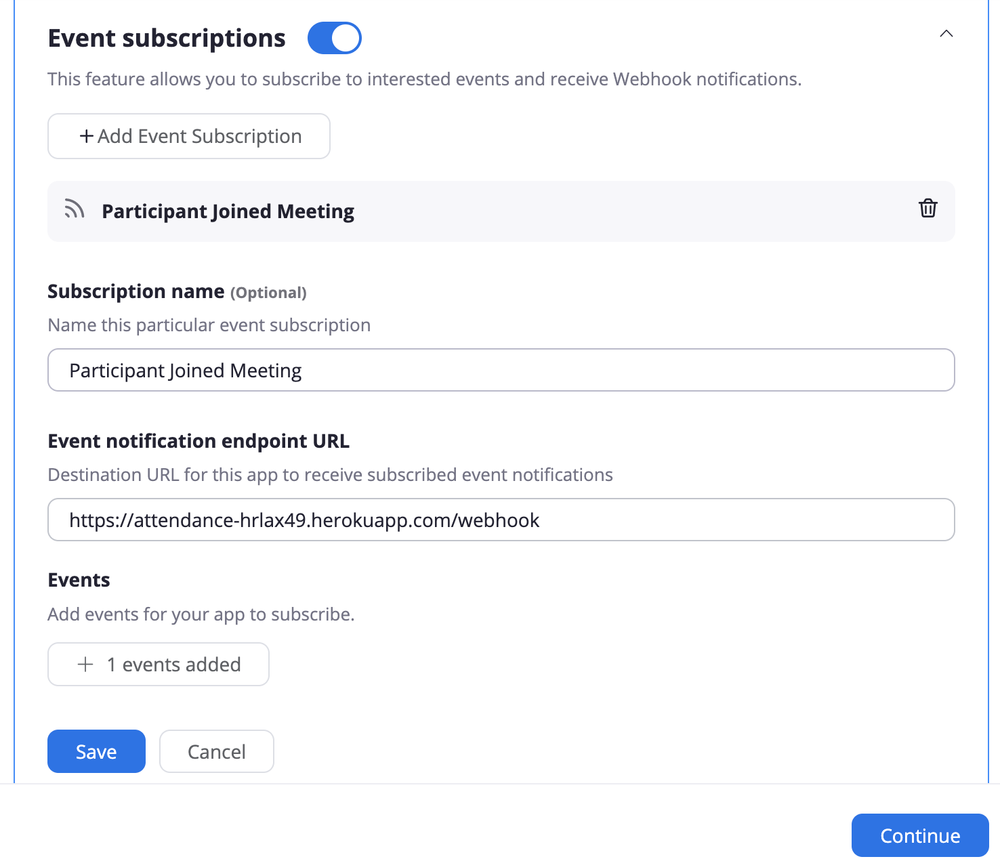

# A Ten Dance! 
### Status : Development - Inactive
-----
* React.js
* Express
* Node
* Threejs (playing with 3d assets)
* MaterialUI
* Heroku
* Zoom Api (Webhooks)

### Summary
This was a short exploration into the Zoom API and Proof of concept to create an online attendance tool that could be automated in order to make daily attendance more efficient. Some pieces (Authentication, Session, Persistant Databases, and Report Generation) are scaffolded, but not functional in any live deployment scheme. If you'd like to contribute, please do! Its a simple, but useful tool with a specific use case.

### What does this solve?
-----
During my time as a Software Engineer in Residence at Hack Reactor, part of our job was taking attendance for members of the cohort each morning. Scheduling was tight, and cohort members could often number 30+. The traditional cross checking of Zoom participant lists and an excel spreadsheet lead could often run long, preventing some students from making their morning lectures on time!

### How does this solve the problem?
------
By tapping into Zoom's API, we setup a webook to post notifications to our server when a participant joins a specific zoom room. A WebSocket listener then notifies the Front end client, and updates the UI to visually cue the student that their attendance has been recorded.
Removing the manual check from the Software Engineer in Residence allows to accomplish classroomp attendance much more efficiently, ensuring students can maximize their time. Wahoo!

## Setup
------
Replace `enrollement.example.js ` with `enrollment.js` following the structure. This file is referenced for your apps current enrollment. The regex parser is set to expect A Full legal name, with preferred name in parens. Ex Benjamin (Ben) Bernardy. The regex parser will also trim brackets [] preceeding the name. This was a naming convention setup by HR.

1. Navigate to Zoom in order to setup webhooks. .
2. Make sure to grab your Zoom API key and store it in the root directory `zoom_token.txt` for reference with expanded API interactions.

Ensure the webhooks POSTs to your deployed instance with the endpoint /webhook.

Currently established ENV Variables in anticipation of persistent datastore.

|ENV Variable| Default value |
|------------|--------------------|
| MYSQL_HOST | defaults to 'root' |
| MYSQL_PASS | defaults to '' |
| MYSQL_DB | defaults to 'attendance' |
| MYSQL_HOST | defaults to 'localhost' |
| PORT | defaults to 3000 |

#### Revisiting
1. I would love to continue to implement a more dynamic asset supply so other orgs could easily inmplement this system.
2. Fully fleshing out a strategy for data visibility based on submitted reports in order to contextualize attendance patterns.

